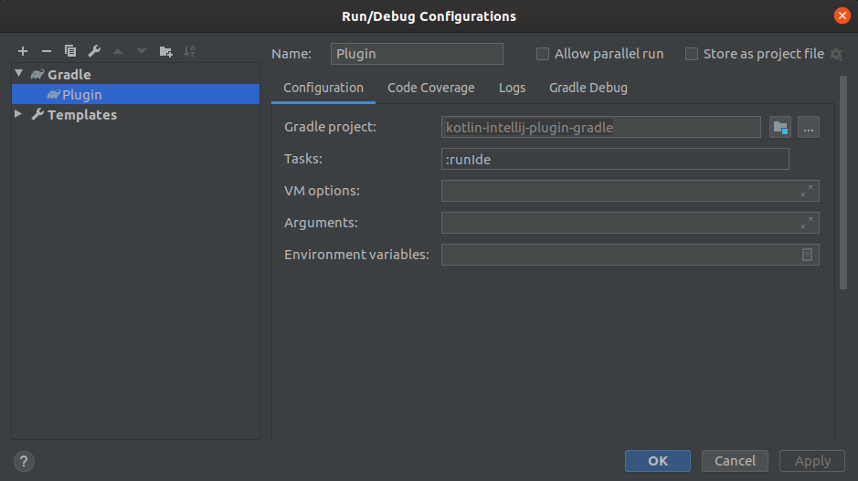

Kotlin Intellij Plugin
===================

Example plugin for intellij in kotlin + gradle

Implementation in the Kotlin language using the gradle "Custom Language Support Tutorial" to create custom language support. All files were overwritten to kotlin.

#### [Custom Language Support Tutorial](https://www.jetbrains.org/intellij/sdk/docs/tutorials/custom_language_support_tutorial.html)

1. [Prerequisites](https://www.jetbrains.org/intellij/sdk/docs/tutorials/custom_language_support/prerequisites.html)
2. [Language and File Type](https://www.jetbrains.org/intellij/sdk/docs/tutorials/custom_language_support/language_and_filetype.html)
3. [Grammar and Parser](https://www.jetbrains.org/intellij/sdk/docs/tutorials/custom_language_support/grammar_and_parser.html)
4. [Lexer and Parser Definition](https://www.jetbrains.org/intellij/sdk/docs/tutorials/custom_language_support/lexer_and_parser_definition.html)
5. [Syntax Highlighter and Color Settings Page](https://www.jetbrains.org/intellij/sdk/docs/tutorials/custom_language_support/syntax_highlighter_and_color_settings_page.html)
6. [PSI Helpers and Utilities](https://www.jetbrains.org/intellij/sdk/docs/tutorials/custom_language_support/psi_helper_and_utilities.html)
7. [Annotator](https://www.jetbrains.org/intellij/sdk/docs/tutorials/custom_language_support/annotator.html)
8. [Line Marker Provider](https://www.jetbrains.org/intellij/sdk/docs/tutorials/custom_language_support/line_marker_provider.html)
9. [Completion Contributor](https://www.jetbrains.org/intellij/sdk/docs/tutorials/custom_language_support/completion_contributor.html)
10. [Reference Contributor](https://www.jetbrains.org/intellij/sdk/docs/tutorials/custom_language_support/reference_contributor.html)
11. [Find Usages Provider](https://www.jetbrains.org/intellij/sdk/docs/tutorials/custom_language_support/find_usages_provider.html)
12. [Folding Builder](https://www.jetbrains.org/intellij/sdk/docs/tutorials/custom_language_support/folding_builder.html)
13. [Go To Symbol Contributor](https://www.jetbrains.org/intellij/sdk/docs/tutorials/custom_language_support/go_to_symbol_contributor.html)
14. [Structure View Factory](https://www.jetbrains.org/intellij/sdk/docs/tutorials/custom_language_support/structure_view_factory.html)
15. [Formatter](https://www.jetbrains.org/intellij/sdk/docs/tutorials/custom_language_support/formatter.html)
16. [Code Style Settings](https://www.jetbrains.org/intellij/sdk/docs/tutorials/custom_language_support/code_style_settings.html)
17. [Commenter](https://www.jetbrains.org/intellij/sdk/docs/tutorials/custom_language_support/commenter.html)
18. [Quick Fix](https://www.jetbrains.org/intellij/sdk/docs/tutorials/custom_language_support/quick_fix.html)

#### Custom example:
- ListenFile (open/close)
- KotlinHelloAction (ToolBar menu)

